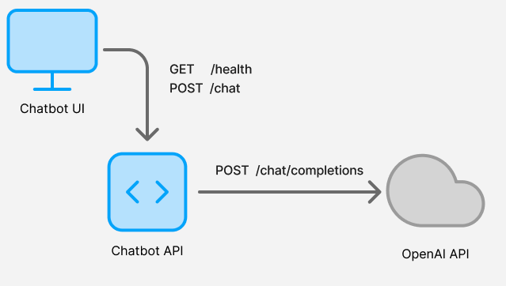

# AI Chatbot - A Guide on Using Blackbird to Enhance API Development
This guide walks you through [Blackbird's](https://getblackbird.io) features using an example AI chatbot application.

## About the App
The AI Chatbot is a NextJS app that sits on top of a simple Restful API powered by NodeJS and Express.

The UI makes calls to the Restful API to submit a chat message. The API proxies those requests to OpenAI and serves responses back to the UI.

## Setting up Blackbird
1. Installation
- VSCode Extension
.. Go to the VSCode extensions marketplace (TODO insert link) to install Blackbird
- Cursor
.. If you are using Cursor, use the same extension downloaded from the VSCode extension marketplace
- CLI
.. You may download and install the Blackbird CLI directly
2. Login to Blackbird
- From the VSCode extension click "Login to Blackbird"
- Alternatively from the CLI run `blackbird login`
- You can use a Google, GitHub, or Windows account to start a free trial of Blackbird

## Running and Testing the UI
TODO

## Running and Testing the API
TODO

## GitHub CI Workflow
TODO
